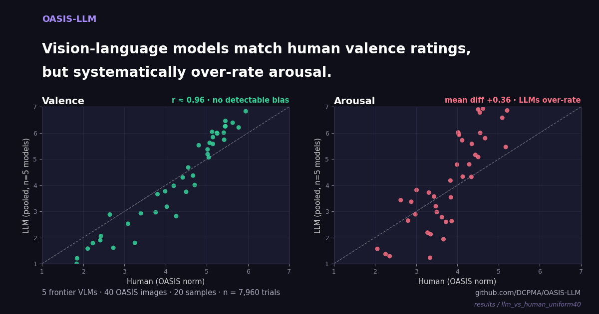
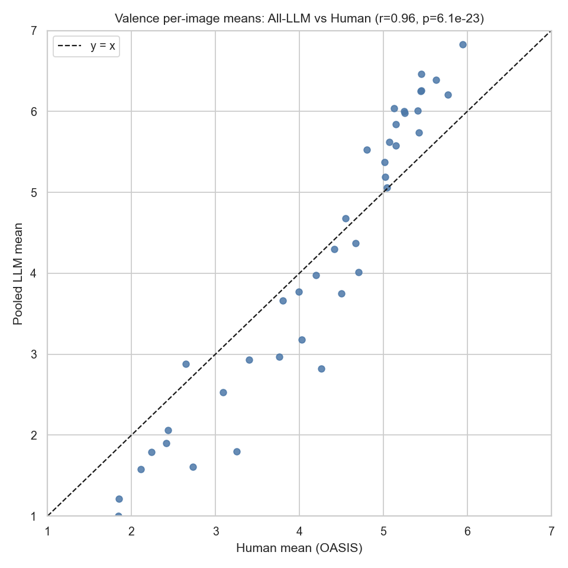
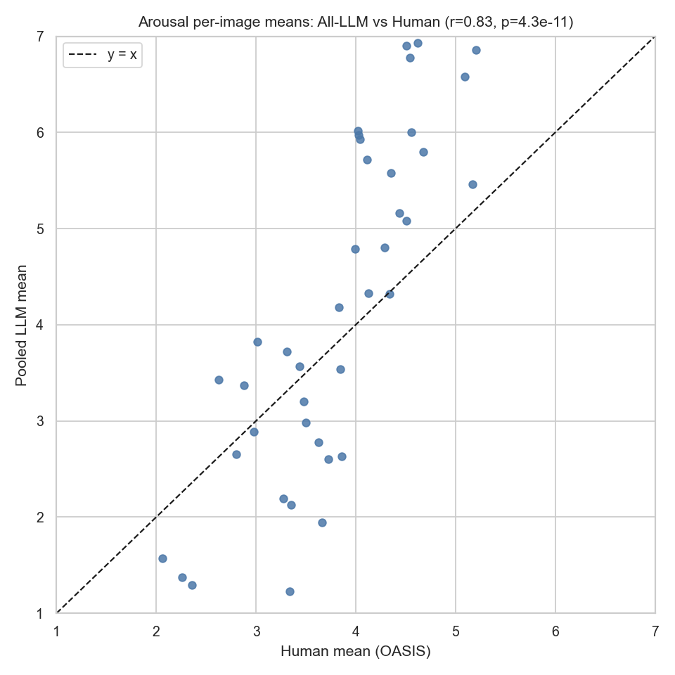
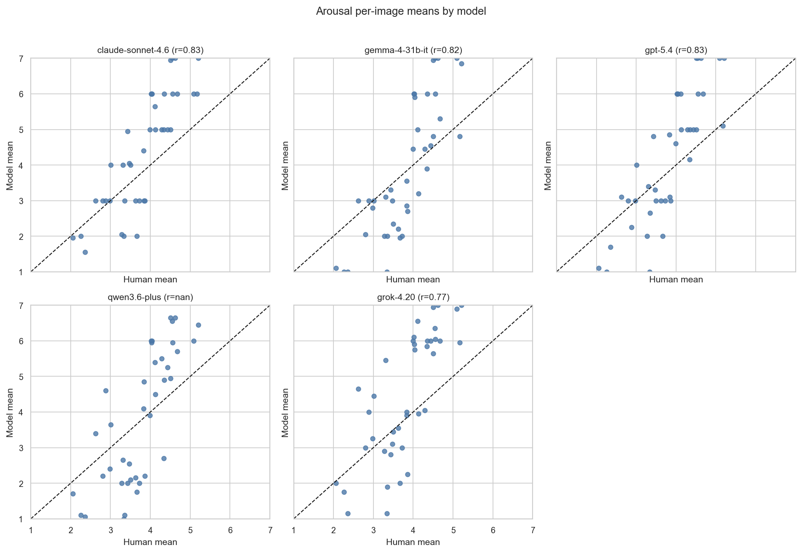
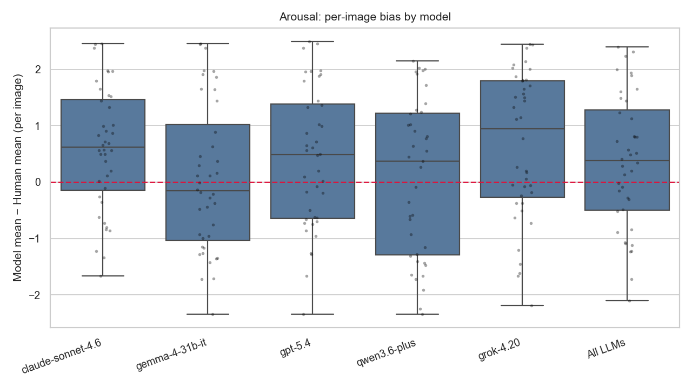

# LLM vs Human Norms on OASIS — 40-image Pilot

<p align="center">
  
</p>

> **First published OASIS-LLM result.** Five frontier vision-language models, 40 OASIS images, 20 samples per image-model pair, 7,960 trials total. Measures per-image agreement with the [Kurdi, Lozano, & Banaji (2017)](https://doi.org/10.3758/s13428-016-0715-3) MTurk human norms on **valence** and **arousal**.

## TL;DR

- **Valence**: LLMs track humans tightly. Pearson _r_ = 0.93–0.96 per model; pooled mean difference is −0.03 on a 1–7 scale (_p_ = 0.79). **No detectable bias.**
- **Arousal**: LLMs systematically rate images **higher** than humans. Pooled mean difference +0.36 (paired _p_ = 0.064; raw-trial Welch _p_ = 0.0087). Driven by Claude, GPT-5, and Grok; Gemma and Qwen are statistically indistinguishable from humans.
- **Methodological implication**: a vision-language model can serve as a reasonable proxy for human valence ratings on naturalistic images, but its arousal ratings need calibration before use as a stand-in for human norms.

---

## Cohort

| Field                      | Value                                                                                                                |
| -------------------------- | -------------------------------------------------------------------------------------------------------------------- |
| Image set                  | `20260426-uniform40` — 40 OASIS images, uniform across the 4 categories (animal, object, person, scene)              |
| Models                     | `anthropic/claude-sonnet-4.6`, `google/gemma-4-31b-it`, `openai/gpt-5.4`, `qwen/qwen3.6-plus`, `x-ai/grok-4.20`      |
| Samples per (image, model) | 20                                                                                                                   |
| Total trials               | 7,960 (`qwen3.6-plus` returned no rating for 1 image → 39 paired images, 780 trials)                                 |
| Rating dimensions          | Valence, arousal — separate calls per dimension (no within-call interaction)                                         |
| Rating scale               | 1–7 Likert, identical to the human MTurk protocol                                                                    |
| Reference                  | OASIS `Valence_mean` / `Arousal_mean` per image (n=822 human raters across all 900 images, ~3,650 ratings per image) |
| Image presentation         | Base64-embedded into the LLM call (not URL-hosted) for reproducibility                                               |
| Date generated             | 2026-04-26                                                                                                           |

## Headline figures

### Aggregate agreement: pooled-LLM mean vs human mean per image

<table>
<tr><td><b>Valence</b></td><td><b>Arousal</b></td></tr>
<tr>
<td></td>
<td></td>
</tr>
</table>

The valence cloud sits on the identity line. The arousal cloud sits visibly above it.

### Per-model breakdown — arousal



### Bias distribution — arousal (LLM mean minus human mean, per image)



## Numerical results

### Valence — paired t-test on 40 image-level means

| Model                 | Mean diff |   _t_(39) |       _p_ | Cohen's _d_ | Pearson _r_ |
| --------------------- | --------: | --------: | --------: | ----------: | ----------: |
| claude-sonnet-4.6     |     −0.13 |     −1.08 |     0.286 |       −0.17 |        0.93 |
| gemma-4-31b-it        |     −0.13 |     −1.13 |     0.265 |       −0.18 |        0.94 |
| gpt-5.4               | **−0.27** |     −2.12 | **0.039** |       −0.34 |        0.96 |
| qwen3.6-plus          |     −0.06 |     −0.51 |     0.616 |       −0.08 |        0.95 |
| grok-4.20             |     +0.16 |      1.07 |     0.291 |       +0.17 |        0.93 |
| **All LLMs (pooled)** | **−0.03** | **−0.26** |  **0.79** |   **−0.04** |    **0.96** |

### Arousal — paired t-test on 40 image-level means

| Model                 | Mean diff |  _t_(39) |        _p_ | Cohen's _d_ | Pearson _r_ |
| --------------------- | --------: | -------: | ---------: | ----------: | ----------: |
| claude-sonnet-4.6     | **+0.59** |     3.45 | **0.0014** |       +0.54 |        0.83 |
| gemma-4-31b-it        |     +0.13 |     0.86 |      0.396 |       +0.14 |        0.79 |
| gpt-5.4               | **+0.41** |     2.07 |  **0.045** |       +0.33 |        0.81 |
| qwen3.6-plus          |     +0.20 |     1.32 |      0.194 |       +0.21 |        0.78 |
| grok-4.20             | **+0.65** |     3.14 | **0.0032** |       +0.50 |        0.76 |
| **All LLMs (pooled)** | **+0.36** | **1.91** |  **0.064** |   **+0.30** |    **0.83** |

The full per-model + Welch tables are in [`ttests_per_model.csv`](ttests_per_model.csv) and [`ttests_aggregate.csv`](ttests_aggregate.csv).

### Cohort descriptives

| Source            | Dimension | n trials | Mean |   SD |
| ----------------- | --------- | -------: | ---: | ---: |
| Human (OASIS)     | valence   |      900 | 4.33 | 1.23 |
| All LLMs (pooled) | valence   |    3,980 | 4.22 | 1.82 |
| Human (OASIS)     | arousal   |      900 | 3.67 | 0.84 |
| All LLMs (pooled) | arousal   |    3,980 | 4.15 | 1.71 |

LLMs use the full 1–7 scale (SD almost double the human SD on both dimensions) — they are more decisive at the tails than the average human rater. Full breakdown in [`descriptives.csv`](descriptives.csv).

## Methodology

The full 6-step rating protocol (image → prompt → call → parse → store → analyse) is documented in the platform's [Discoveries · Methodology](https://dcpma.mintlify.app/discoveries-methodology) page. This run uses the platform defaults:

- One image per call, base64-embedded
- One rating dimension per call (valence-only or arousal-only), to avoid order effects
- Stateless — each trial is an independent API request
- Default temperature for each provider (no adjustment)
- 20 independent samples per (image, model, dimension) — used as a sample of the model's underlying distribution
- Image-level mean per (image, model) computed before paired t-test

Three statistical tests are reported:

1. **Per-model paired t-test on 40 image means** (primary inference). Compares the LLM's per-image mean to the OASIS human per-image mean, paired by image. Reports paired _t_, _p_, Cohen's _d_ (mean diff / SD of diffs), and Pearson _r_ between LLM and human per-image means.
2. **Per-model Welch t-test on raw trials.** Trial-level LLM ratings vs the 40 human image means. Treats human values as fixed targets — useful for assessing whether the LLM's full rating distribution lies above or below the human mean.
3. **Aggregate test.** Pooled-LLM image mean (average of the 5 model means per image) vs human image mean — paired t-test on 40 images, plus a Welch test on all 3,980 LLM trials.

The analysis script is [`scripts/llm_vs_human_ttest.py`](../../scripts/llm_vs_human_ttest.py). All figures are reproduced from [`per_image_means_valence.csv`](per_image_means_valence.csv) and [`per_image_means_arousal.csv`](per_image_means_arousal.csv).

## Choices made

- **Sample 40 images, not 900.** Pilot scope. The 40-image n was informed by published image-rating reliability estimates (cf. small-n psychometric pilots in the affective-image literature) which suggest that a per-image mean over ~20 raters has a standard error small enough that 40 paired images give adequate power to detect a per-image bias of |d| ≈ 0.4 with α = 0.05 and (1-β) ≈ 0.8. The 40 are uniform across the 4 OASIS categories (10 each), drawn deterministically by stratified sampling.
- **20 samples per pair.** Mirrors the per-image n that human MTurk participants typically contribute in the published OASIS norms after exclusions, and gives an LLM image-mean SE of ~SD/√20.
- **Five models, this combination.** Pilot scope. Cover frontier closed (Claude Sonnet 4.6, GPT-5.4, Grok 4.20) plus an open-weights frontier (Gemma 4 31B-IT) and an open-weights baseline (Qwen 3.6 Plus). One model per major lab. Open-weights via OpenRouter; the closed models likewise via OpenRouter for parity.
- **Valence and arousal in separate calls.** Mirrors the human MTurk protocol where each participant rated one dimension. Avoids order effects and within-call self-anchoring.
- **Stateless one-image-per-call.** The harness sends each (image, dimension, sample) as an independent API request rather than chaining many images into a single conversation. This mirrors the human protocol — each MTurk participant rated one image at a time without context from prior ratings — and prevents any single trial from contaminating the next via in-context anchoring.
- **Paired image-level t-test as primary inference.** Image is the natural unit of analysis: the OASIS norms are image-level. The Welch test on raw trials is reported but treated as secondary because it conflates within-image LLM variance with the bias being measured.

## Restrictions and caveats

- **Five models is a small slice.** Pilot scope. Conclusions about "vision-language models" generalize at most to frontier-tier instruction-tuned VLMs ca. April 2026. Smaller distilled models, fine-tuned variants, and earlier-generation models are not covered.
- **Forty images is a small slice.** 4.4% of the OASIS set. Per-category n=10 is too small to look at category × model interactions reliably. The arousal bias signal is strong enough to survive this n; the valence null-finding is more vulnerable to undercounting.
- **One image missing for `qwen3.6-plus`.** Affects per-model n for Qwen only (39 paired images, 780 trials per dimension); other models are unaffected. The image was retried; calls returned no parseable rating, most likely the served-model version refused due to a content-safety guardrail (the image content is consistent with a nudity / sensitive-content trigger). This is itself a finding about how guardrails interact with affective rating tasks; the conclusion is reported with Qwen's reduced n.
- **Default temperature.** Each provider's default sampling temperature was used. Behaviour at temperature=0 (deterministic) or higher temperatures is not characterized.
- **Single-call, no chain-of-thought.** Models were not given an opportunity to chain-of-thought before producing the rating. This is a deliberate methodological choice (see Choices) rather than an omission — we want trials to be statistically independent and to mirror the no-context human MTurk protocol — but it does mean we are not characterising what these models would rate after a CoT step. Out of scope for v1.
- **Date-bounded.** Models were called in late April 2026. Provider-side model updates may shift these numbers; rerun before citing in long-form work.
- **Human reference is the published OASIS mean, not raw participant data.** The MTurk SE on each image mean is ~0.05 (1.5 / √850). The bias estimates above are an order of magnitude larger than this reference noise, so it does not affect the qualitative conclusions, but the formal tests are paired t-tests against a fixed value, not a two-sample comparison.

## Files in this directory

- [`README.md`](README.md) — this page
- [`setup/`](setup/) — experiment setup
  - [`setup/experiment_config.json`](setup/experiment_config.json) — per-model run configurations (provider, model id, samples, timeouts) used to produce the run
  - [`setup/models.csv`](setup/models.csv) — one row per model, with provider, model id, run id, status, and start/finish timestamps
  - [`setup/image_set.csv`](setup/image_set.csv) — the 40 OASIS images used, with category and the human valence/arousal means as reference
  - [`setup/prompt_template.md`](setup/prompt_template.md) — verbatim system + user prompts and the JSON schema for structured output
- [`raw/`](raw/) — raw trial-level data
  - [`raw/trials.csv`](raw/trials.csv) — every individual rating, 8,000 rows (7,960 done + 40 missing for Qwen). Includes provenance (`prompt_hash`, `attempts`, `finish_reason`), cost (`latency_ms`, `input_tokens`, `output_tokens`, `cost_usd`), and the literal model output (`raw_response`, `reasoning` where available). Provider trace IDs are intentionally stripped.
- [`descriptives.csv`](descriptives.csv) — n, mean, SD, median, min, max per source × dimension
- [`per_image_means_valence.csv`](per_image_means_valence.csv) — wide table: image × (each model, LLM_mean, Human_mean, Category) for valence
- [`per_image_means_arousal.csv`](per_image_means_arousal.csv) — same for arousal
- [`ttests_per_model.csv`](ttests_per_model.csv) — paired and Welch t-tests for every model × dimension
- [`ttests_aggregate.csv`](ttests_aggregate.csv) — pooled-LLM vs human, paired and Welch
- [`plots/`](plots/) — 22 PNGs (violin, histogram, scatter, bias-box) — see "All plots" below

## All plots

<details>
<summary><b>Valence (11 plots)</b> — click to expand</summary>

| Plot                                                              | Filename                                                                         |
| ----------------------------------------------------------------- | -------------------------------------------------------------------------------- |
| Violin: per-model rating distributions vs human mean ± 1 SD       | [`plots/violin_valence.png`](plots/violin_valence.png)                           |
| Histogram: pooled LLM trial ratings vs human image means          | [`plots/hist_aggregate_valence.png`](plots/hist_aggregate_valence.png)           |
| Scatter: pooled LLM_mean vs Human_mean (with y=x and Pearson _r_) | [`plots/scatter_aggregate_valence.png`](plots/scatter_aggregate_valence.png)     |
| Scatter: per-model LLM_mean vs Human_mean                         | [`plots/scatter_per_model_valence.png`](plots/scatter_per_model_valence.png)     |
| Scatter: by model, pooled image means                             | [`plots/scatter_by_model_valence.png`](plots/scatter_by_model_valence.png)       |
| Scatter: by category (animal/object/person/scene)                 | [`plots/scatter_by_category_valence.png`](plots/scatter_by_category_valence.png) |
| Scatter: animal subset                                            | [`plots/scatter_animal_valence.png`](plots/scatter_animal_valence.png)           |
| Scatter: object subset                                            | [`plots/scatter_object_valence.png`](plots/scatter_object_valence.png)           |
| Scatter: person subset                                            | [`plots/scatter_person_valence.png`](plots/scatter_person_valence.png)           |
| Scatter: scene subset                                             | [`plots/scatter_scene_valence.png`](plots/scatter_scene_valence.png)             |
| Bias boxplot: (model − human) per-image differences               | [`plots/bias_box_valence.png`](plots/bias_box_valence.png)                       |

</details>

<details>
<summary><b>Arousal (11 plots)</b> — click to expand</summary>

| Plot                | Filename                                                                         |
| ------------------- | -------------------------------------------------------------------------------- |
| Violin              | [`plots/violin_arousal.png`](plots/violin_arousal.png)                           |
| Histogram aggregate | [`plots/hist_aggregate_arousal.png`](plots/hist_aggregate_arousal.png)           |
| Scatter aggregate   | [`plots/scatter_aggregate_arousal.png`](plots/scatter_aggregate_arousal.png)     |
| Scatter per model   | [`plots/scatter_per_model_arousal.png`](plots/scatter_per_model_arousal.png)     |
| Scatter by model    | [`plots/scatter_by_model_arousal.png`](plots/scatter_by_model_arousal.png)       |
| Scatter by category | [`plots/scatter_by_category_arousal.png`](plots/scatter_by_category_arousal.png) |
| Scatter animal      | [`plots/scatter_animal_arousal.png`](plots/scatter_animal_arousal.png)           |
| Scatter object      | [`plots/scatter_object_arousal.png`](plots/scatter_object_arousal.png)           |
| Scatter person      | [`plots/scatter_person_arousal.png`](plots/scatter_person_arousal.png)           |
| Scatter scene       | [`plots/scatter_scene_arousal.png`](plots/scatter_scene_arousal.png)             |
| Bias boxplot        | [`plots/bias_box_arousal.png`](plots/bias_box_arousal.png)                       |

</details>

## Reproducing

This page is fully self-contained: the raw trial-level data is checked in at [`raw/trials.csv`](raw/trials.csv) and the analysis output is fully reproducible from it. From a clone of this repo:

```bash
uv run python scripts/llm_vs_human_ttest.py \
    --image-set 20260426-uniform40 \
    --output-dir results/llm_vs_human_uniform40
```

The analysis script reads from the harness DuckDB by default; to reproduce strictly from the checked-in raw CSV, point it at [`raw/trials.csv`](raw/trials.csv) directly (or re-import the raw rows into a fresh DuckDB via `oasis_llm.bundles.import_any` and re-run).

## Citation

If you cite this analysis, please also cite the underlying OASIS norms:

> Kurdi, B., Lozano, S., & Banaji, M. R. (2017). Introducing the Open Affective Standardized Image Set (OASIS). _Behavior Research Methods, 49_(2), 457–470. https://doi.org/10.3758/s13428-016-0715-3

The harness itself is described in the [`OASIS-LLM` repo](https://github.com/DCPMA/OASIS-LLM) and the [docs site](https://dcpma.mintlify.app); see [`CITATION.cff`](../../CITATION.cff) for the machine-readable form.
