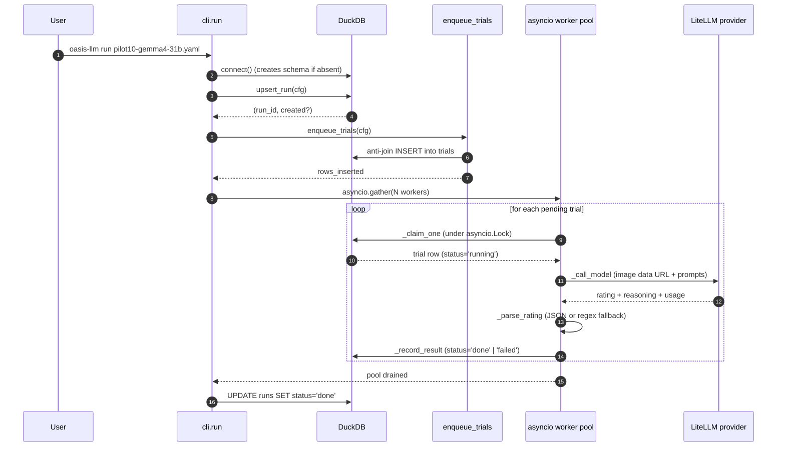
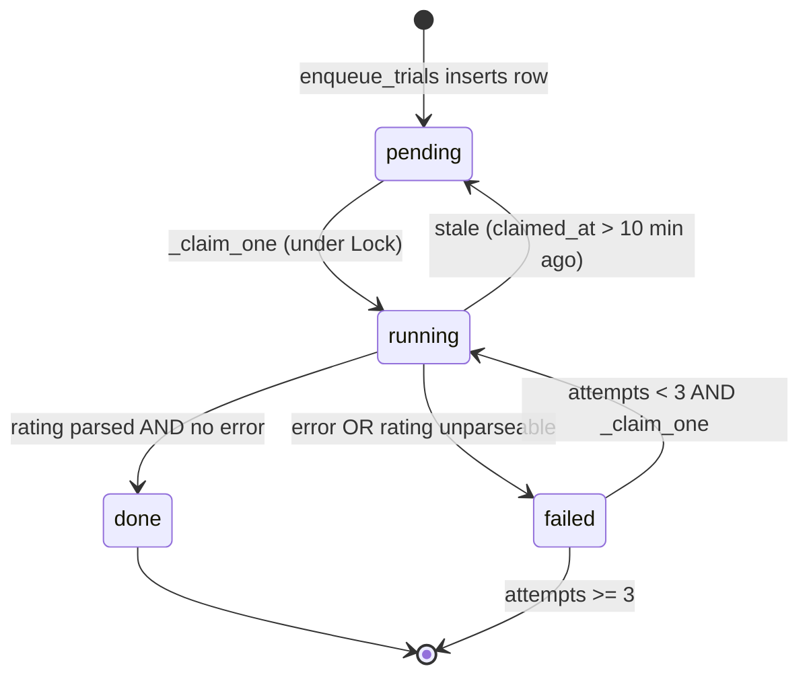

## End-to-end sequence

What actually happens when you type `uv run oasis-llm run configs/runs/pilot10-gemma4-31b.yaml`:



### Key invariants

- **Atomic claim.** `_claim_one` runs under a single `asyncio.Lock`, so within one process two workers never grab the same trial. The runner is single-process by design — there is no cross-process locking.
- **Stale-claim recovery.** Before claiming, `_claim_one` resets any trial whose `status='running'` and `claimed_at < now() - 10 min` back to `pending`. So if a worker is killed mid-flight, the next runner invocation reclaims it after at most 10 minutes.
- **Retry budget.** A trial is eligible for re-claim while `status='pending'` OR (`status='failed'` AND `attempts < 3`). Each `_record_result` increments `attempts` regardless of success or failure.

## Trial lifecycle



A trial reaches a terminal state when it is either `done`, or `failed` with `attempts >= 3`. The ordering inside `_claim_one` is:

```sql
ORDER BY attempts, sample_idx, image_id, dimension
LIMIT 1
```

so fresh trials drain before retries, and within an attempt-tier, low `sample_idx` go first.

## Trial record

Every `(run_id, image_id, dimension, sample_idx)` row carries:

| Column                           | Type      | Meaning                                                          |
| -------------------------------- | --------- | ---------------------------------------------------------------- |
| `status`                         | TEXT      | `pending` / `running` / `done` / `failed`                        |
| `rating`                         | INTEGER   | Parsed 1–7 rating, NULL on failure                               |
| `raw_response`                   | TEXT      | Verbatim model output                                            |
| `reasoning`                      | TEXT      | Parsed JSON `reasoning` field, NULL if absent                    |
| `prompt_hash`                    | TEXT      | sha256(model + system + user)\[:16\], for prompt-version diffing |
| `latency_ms`                     | INTEGER   | Wall-clock from `_call_model` start                              |
| `input_tokens` / `output_tokens` | INTEGER   | From provider usage block                                        |
| `cost_usd`                       | DOUBLE    | LiteLLM cost, falls back to OpenRouter `usage.cost`              |
| `error`                          | TEXT      | Error message, NULL on success                                   |
| `finish_reason`                  | TEXT      | Provider's finish reason (e.g. `stop`, `length`)                 |
| `response_id`                    | TEXT      | Provider's response ID, useful for trace correlation             |
| `attempts`                       | INTEGER   | Bumped by every `_record_result`                                 |
| `claimed_at`, `completed_at`     | TIMESTAMP | For stale recovery and latency analysis                          |

See [Configuration](/configuration) for what controls each of these.

## Resumption semantics

`upsert_run` enforces that the **canonical config hash** matches what's already stored for that `run_id`:

```python
if existing[0] != cfg_hash:
    raise RuntimeError(
        f"Run '{run_id}' exists with different config hash "
        f"(stored={existing[0]}, new={cfg_hash}). Use a new --name or --new-run."
    )
```

The hash deliberately **excludes** `name`, `max_concurrency`, `request_timeout_s`, `max_retries`, and `samples_per_image`. So you can:

- Bump `max_concurrency` between runs of the same experiment.
- Resume a run with a longer `request_timeout_s`.
- Extend `samples_per_image` from 5 to 20 without invalidating earlier samples.

You **cannot** silently change the model, the prompt overrides, the dimensions, the image set, or anything else that affects what the model sees. Those require a new `name`.
